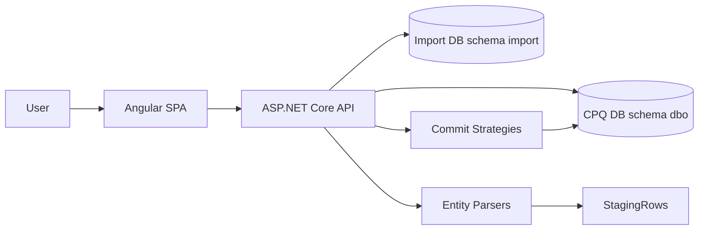
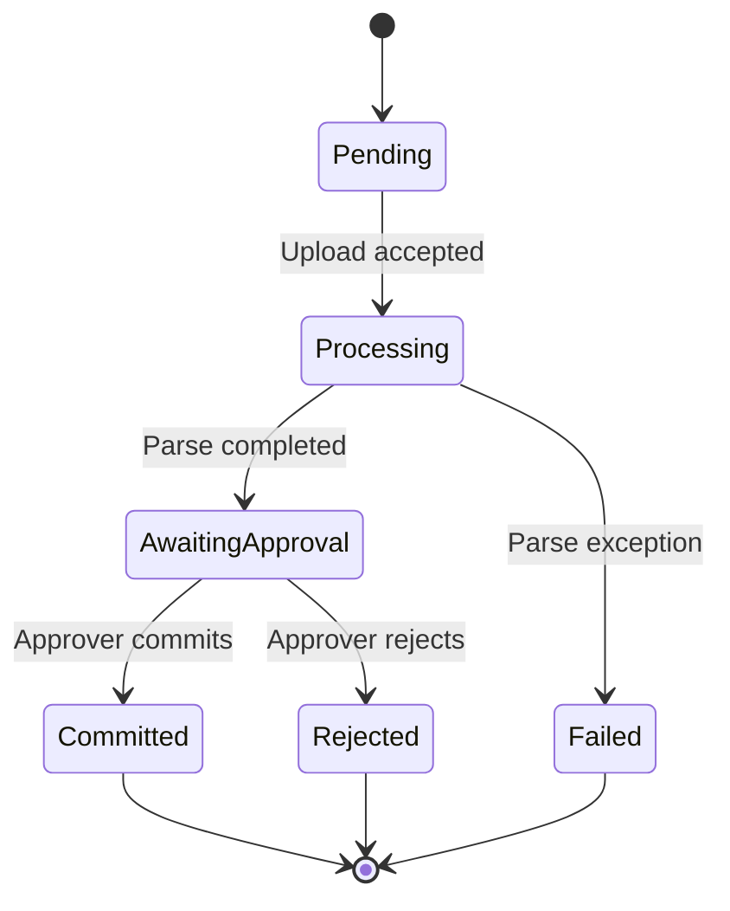

# CPQ Import App - Complete Onboarding Guide

Last updated: 2026-06-25

## 1) What this system does

The CPQ Import App is a controlled import pipeline for CPQ master data. It allows users to upload structured files, validates each row, lets approvers review the results, and then commits valid data into CPQ tables.

Core capabilities:
- Upload CSV or Excel files for one entity type at a time.
- Parse and validate rows into a staging area.
- Track import job status and audit trail.
- Approve and commit valid/warning rows into CPQ with transactional upserts.
- Reject jobs with a reason.
- Generate templates and error reports.

## 2) High-level architecture

The solution uses a layered architecture with clear boundaries:
- API layer: controllers, auth, DTO mapping, HTTP concerns.
- Core layer: enums, entities, interfaces (contracts).
- Infrastructure layer: EF Core persistence, parsers, commit strategies, template/report generation.
- UI layer: Angular SPA for upload, preview, approval.

### Design style

Main patterns used:
- Layered architecture.
- Strategy pattern for entity-specific commit behavior.
- Interface-driven services and repositories.
- Staging-and-approve workflow (no direct write from upload to CPQ).
- DTO mapping boundary between API and domain models.

## 3) Solution structure and responsibilities

Top level:
- CPQ_Import_App.sln: solution with API, Core, Infrastructure, Tests.
- docker-compose.yml: local composed runtime for SQL Server + API + frontend.
- Dockerfile: API container build.
- cpq-import-ui: Angular frontend app.

Projects:
- src/CPQ_Import_App.API
	- Entry point, DI, auth/authorization, controllers, DTO contracts.
- src/CPQ_Import_App.Core
	- Domain contracts and shared model definitions.
- src/CPQ_Import_App.Infrastructure
	- Data access, parser/validator implementations, commit logic, Excel generation.
- tests/CPQ_Import_App.Tests
	- Unit tests (currently parser-focused).

## 4) End-to-end business flow

### Upload to commit lifecycle

Detailed flow:
1. User uploads file with selected entity type.
2. API validates basic constraints (size, extension, entity enum).
3. Service creates ImportJob, stores original file bytes.
4. Entity parser reads rows and applies validation.
5. Parsed rows are stored in StagingRows (JSON payload + validation messages).
6. Job aggregates are computed (valid/warning/error counts).
7. Job status becomes AwaitingApproval.
8. Approver can:
	 - Commit: valid + warning rows are upserted to CPQ in a DB transaction.
	 - Reject: status changed with required reason.
9. Audit log records key actions.

## 5) Backend deep dive

### 5.1 API bootstrapping and dependency injection

In Program.cs:
- Adds AppDbContext with SQL Server and migrations assembly in Infrastructure.
- Registers repository and service:
	- IImportRepository -> ImportRepository
	- IImportService -> ImportService
- Registers all parsers as IFileParser implementations:
	- Article, PriceList, Description, CurrencyRate
- Registers all commit strategies as ICpqCommitStrategy implementations.
- Configures auth:
	- Development mode: fake authenticated user when Auth:DisableAuth=true.
	- Production mode: JWT Bearer with Authority and Audience.
- Adds authorization policy ApproverOnly requiring role claim cpq-approver.
- Adds CORS policy Angular from configuration.
- Enables Swagger in development.
- Auto-applies EF migrations in development on startup.

Architecture decision:
- Auto migration in development speeds local setup.
- Production is expected to use controlled migration deployment.

### 5.2 Controllers and endpoint behavior

ImportsController routes:
- POST /api/imports/upload
	- Auth required.
	- Accepts multipart file + query entityType.
	- Validates extension (.xlsx/.csv), max 10MB, enum value.
	- Creates job and returns 201 with job DTO.
- GET /api/imports/{id}
	- Job detail.
- GET /api/imports
	- Paged jobs list (page, pageSize).
- GET /api/imports/{id}/rows
	- Paged rows with optional status filter.
- POST /api/imports/{id}/commit
	- ApproverOnly policy.
	- Commits valid+warning rows.
- POST /api/imports/{id}/reject
	- ApproverOnly policy.
	- Requires rejection reason.
- GET /api/imports/{id}/download
	- Returns original uploaded file.
- GET /api/imports/{id}/error-report
	- Returns generated Excel error report.

TemplatesController routes:
- GET /api/templates/{entityType}
	- Returns generated import template for selected entity.

### 5.3 Core domain contracts

Enums:
- EntityType: Unknown, Article, PriceList, Description, CurrencyRate
- ImportStatus: Pending, Processing, AwaitingApproval, Committed, Rejected, Failed
- RowStatus: Valid, Warning, Error

Primary entities:
- ImportJob
	- Metadata, status timestamps, counters, decision fields.
- StagingRow
	- One uploaded row with status + raw JSON + validation JSON.
- AuditLog
	- Action trail for upload, commit, reject, fail.

Interfaces:
- IImportService: orchestration contract.
- IImportRepository: persistence contract.
- IFileParser: entity parser contract.
- ICpqCommitStrategy: entity-specific CPQ writer contract.

### 5.4 Infrastructure persistence model

DbContext schema: import

Tables:
- import.ImportJobs
- import.StagingRows
- import.AuditLogs
- import.UploadedFiles

Key relationships:
- ImportJob 1:N StagingRows (cascade delete).
- ImportJob 1:N AuditLogs (cascade delete).
- UploadedFiles keyed by JobId for one raw file per job.

Storage decisions:
- Row data and validation messages are JSON in nvarchar(max).
	- Pros: flexible schema across entity types.
	- Trade-off: no strong relational constraints at row-field level.
- Raw uploaded bytes are persisted in DB (varbinary(max)).
	- Pros: reproducible/downloadable source artifact.
	- Trade-off: DB size growth over time.

### 5.5 Parsing and validation pipeline

RawFileReader:
- Supports .xlsx/.xls via EPPlus and .csv via CsvHelper.
- Reads first row as headers.
- Normalizes values by trim.
- Skips completely empty rows.

RowValidator shared helpers:
- RequireField
- RequireDecimal
- RequireDate
- MaxLength (warning)
- DeriveStatus (Error > Warning > Valid)

Entity parser rules:

ArticleParser expected headers:
- ArticleNumber, Name, Category, Unit
Checks:
- Required: ArticleNumber, Name
- Length warnings on text fields

PriceListParser expected headers:
- ArticleNumber, Price, Currency, ValidFrom, ValidTo
Checks:
- Required: ArticleNumber, Price, Currency, ValidFrom
- Price decimal
- ValidFrom/ValidTo date parse
- Currency 3-letter alpha code

DescriptionParser expected headers:
- ArticleNumber, LanguageCode, ShortDescription, LongDescription
Checks:
- Required: ArticleNumber, LanguageCode, ShortDescription
- Max lengths for language/short/long description

CurrencyRateParser expected headers:
- FromCurrency, ToCurrency, Rate, ValidFrom
Checks:
- Required all headers
- Rate decimal and > 0
- ValidFrom date parse
- Currency fields must be 3-letter alpha

Header validation behavior:
- Missing required columns throws InvalidDataException.
- Upload endpoint maps this to HTTP 422 with message.

### 5.6 Import service orchestration

UploadAsync:
- Copies stream to memory for reuse.
- Creates job with Processing state.
- Saves original bytes.
- Selects parser by entity type.
- Converts parsed rows to StagingRow with JSON payload.
- On parser exception:
	- status Failed
	- ProcessedAt set
	- audit log action Failed with details
	- rethrows
- On success:
	- saves staging rows
	- computes counts
	- status AwaitingApproval
	- writes Uploaded audit event

CommitAsync:
- Ensures job exists and status AwaitingApproval.
- Chooses commit strategy by job entity type.
- Loads staging rows in pages of 500.
- Excludes Error rows.
- Deserializes row dictionaries and commits via strategy.
- Updates status Committed and counters/timestamps.
- Writes Committed audit event.

RejectAsync:
- Ensures status AwaitingApproval.
- Sets Rejected fields and reason.
- Writes Rejected audit event.

GenerateErrorReportAsync:
- Retrieves error rows only.
- Creates Excel with:
	- Row, Status, dynamic field columns, Validation Errors
	- styled header and highlighted error rows.

### 5.7 CPQ commit strategies

All strategies:
- Use Dapper with SQL Server connection to CpqDatabase.
- Wrap row loop in one transaction.
- Use MERGE for upsert semantics.
- Roll back transaction on any failure.

Targets and keys:
- ArticleCommitStrategy
	- Target: dbo.CpqArticles
	- Match key: ArticleNumber
- PriceListCommitStrategy
	- Target: dbo.CpqArticlePrices
	- Match key: ArticleNumber + Currency + ValidFrom
	- Also ensures article exists in dbo.CpqArticles (placeholder insertion).
- DescriptionCommitStrategy
	- Target: dbo.CpqArticleDescriptions
	- Match key: ArticleNumber + LanguageCode
	- Also ensures article exists in dbo.CpqArticles.
- CurrencyRateCommitStrategy
	- Target: dbo.CpqCurrencyRates
	- Match key: FromCurrency + ToCurrency + ValidFrom

Architectural rationale:
- Strategy pattern isolates per-entity SQL and allows independent evolution.
- Shared orchestration in ImportService prevents duplication.

## 6) Security and authorization model

API-level:
- Controllers are protected with [Authorize].
- Commit/Reject require ApproverOnly policy.

Role claim handling:
- Policy checks claim types roles, role, or WS-Federation role URI.
- Required role value: cpq-approver.

Development mode:
- appsettings.Development sets Auth:DisableAuth=true.
- DevelopmentAuthHandler injects local claims including cpq-approver.
- This gives full local access without external IdP.

Production mode expectations:
- Set Auth:Authority and Auth:Audience.
- Ensure issued JWT contains role claim mapping recognized by policy.

## 7) Frontend architecture

Tech stack:
- Angular 18 standalone components.
- Angular Material UI.
- angular-oauth2-oidc for OIDC/OAuth.

Routing:
- /dashboard
- /import/new
- /import/:id
- /forbidden

All main routes are protected by authGuard.

Core UI services:
- ImportService
	- wraps all API calls for imports and templates.
- AuthFacade
	- exposes userName and isApprover.

Authentication behavior:
- If environment.disableAuth=true, guard allows all and facade returns local test values.
- Otherwise, OAuth code flow and bearer token injection through interceptor.

Feature components:
- DashboardComponent
	- paged list of import jobs and summary cards.
- ImportWizardComponent
	- 3-step wizard: type selection, file upload, success transition.
	- client-side file checks (extension, 10MB).
	- template download by selected entity.
- ImportPreviewComponent
	- job summary + row table + filter chips.
	- approver actions for commit/reject.
	- download original file and generated error report.
- ForbiddenComponent
	- role-based access fallback screen.
- StatusBadgeComponent
	- centralized visual mapping for statuses.

Frontend environment configuration:
- development
	- apiUrl: http://localhost:5294/api
	- disableAuth: true
- production
	- apiUrl: /api
	- OIDC placeholders expected to be replaced.

## 8) Deployment and runtime topology

### Local non-container dev

Backend:
1. Configure connection strings in API appsettings.
2. Run API profile http (port 5294 default).
3. Development startup auto-runs migrations.

Frontend:
1. In cpq-import-ui run npm install.
2. Run npm start.
3. Open http://localhost:4200.

### Docker compose

Services:
- sqlserver: mssql 2022, port 1433
- api: ASP.NET Core container, published on host 5000
- frontend: nginx Angular bundle on host 4200

Networking details:
- frontend nginx proxies /api to api container.
- API connection strings target sqlserver service name.

Important note:
- docker-compose API advertises port 5000, while local non-container API uses 5294 from launch settings.

## 9) Data contracts (API DTOs)

ImportJobDto includes:
- identifiers, status labels, actor metadata, lifecycle timestamps.
- row counters (total, valid, warning, error, committed).

StagingRowDto includes:
- row metadata and status.
- dynamic fields dictionary.
- validation messages list with severity.

PagedResult<T>:
- items, total, page, pageSize.

RejectRequest:
- reason (required by controller).

CommitResultDto:
- jobId, committedRows, message.

## 10) Database schema reference

Import DB (schema import):

ImportJobs columns:
- Id (PK)
- FileName
- OriginalFileName
- EntityType (int enum)
- Status (int enum)
- CreatedBy, CreatedByDisplayName
- CreatedAt, ProcessedAt, CommittedAt
- CommittedBy, RejectedBy, RejectedAt, RejectionReason
- TotalRows, ValidRows, WarningRows, ErrorRows, CommittedRows

StagingRows columns:
- Id (PK)
- ImportJobId (FK)
- RowNumber
- Status (int enum)
- RawData (JSON text)
- ValidationMessages (JSON text)
- IsSelected (currently persisted, not used in commit selection logic)

AuditLogs columns:
- Id (PK)
- ImportJobId (FK)
- Action
- PerformedBy, PerformedByDisplayName
- PerformedAt
- Details

UploadedFiles columns:
- JobId (PK)
- FileName
- Content (binary)
- UploadedAt

## 11) Test coverage and quality status

Current test suite:
- xUnit project with 7 tests.
- Focus area: parser behavior for Article and CurrencyRate.

Last verified result:
- dotnet test CPQ_Import_App.sln
- Total: 7
- Passed: 7
- Failed: 0

Coverage gaps:
- No tests yet for:
	- ImportService orchestration
	- Repository persistence behavior
	- Controllers and auth policies
	- PriceListParser and DescriptionParser
	- Commit strategy SQL integration behavior

## 12) Key architecture decisions and trade-offs

1. Staging-first import workflow
- Decision: never write to CPQ during upload.
- Benefit: safe review and controlled approval.
- Trade-off: extra storage and status management complexity.

2. JSON field storage in StagingRows
- Decision: keep row payload flexible and entity-agnostic.
- Benefit: avoids schema churn per entity type.
- Trade-off: weaker DB-level constraints and indexing.

3. Strategy pattern for CPQ writes
- Decision: one commit class per entity.
- Benefit: SQL is isolated, readable, and independently changeable.
- Trade-off: multiple classes to maintain as entity count grows.

4. Development auth bypass
- Decision: local fake identity enabled via config.
- Benefit: faster local productivity.
- Trade-off: must ensure production config does not disable auth.

5. Auto migration in development startup
- Decision: app runs migration on boot in development only.
- Benefit: less setup friction.
- Trade-off: startup side effects; not suitable for strict prod controls.

## 13) Known limitations and risks

1. In-memory file buffering
- UploadAsync copies full file bytes into memory.
- Risk: high memory pressure if larger files are allowed later.

2. Transaction duration for large commits
- One transaction wraps all rows per job.
- Risk: long transaction locks for very large imports.

3. Culture/date parsing differences
- Date parsing uses DateTime.TryParse in validators.
- Risk: locale-dependent parsing ambiguities outside YYYY-MM-DD.

4. No background processing
- Parse and commit run inline in API request context.
- Risk: timeout/user-wait concerns with very large files.

5. Sparse automated tests outside parsers
- Risk: regressions in orchestration/auth/integration paths may go unnoticed.

## 14) How to extend the system

### Add a new import entity type

Checklist:
1. Add enum value in Core EntityType.
2. Add parser implementing IFileParser.
3. Register parser in Program.cs.
4. Add commit strategy implementing ICpqCommitStrategy.
5. Register strategy in Program.cs.
6. Add template definition in TemplateGenerator.
7. Add UI option in ENTITY_TYPE_OPTIONS.
8. Add any frontend icon/label mapping.
9. Add parser and service tests.

### Adjust validation rules

Where:
- Entity parser class for entity-specific rules.
- RowValidator for shared reusable checks.

Guideline:
- Use Warning for advisory, Error for commit-blocking row issues.

### Change CPQ target schema

Where:
- Relevant commit strategy SQL MERGE statement.

Guideline:
- Keep upsert key deterministic.
- Keep each row operation idempotent for repeatable commits.

## 15) Operational runbook

### Typical troubleshooting sequence

1. Upload fails with 422
- Usually missing headers or unsupported format.
- Action: download template and align columns exactly.

2. Upload succeeds but many errors
- Check /rows filtered by Error and download error report.
- Correct source file and re-upload as a new job.

3. Commit fails
- Common causes: CPQ table/schema mismatch, bad connection string, SQL type mismatch.
- Action: inspect API logs, verify CpqDatabase connectivity, validate target tables.

4. 401/403 errors
- Verify Auth config, token audience, and role claim mapping.
- Ensure cpq-approver role is present for commit/reject actions.

5. CORS errors in browser
- Update Cors:AllowedOrigins in API configuration.

### Log/audit points

AuditLogs records action transitions with actor identity and details:
- Uploaded
- Committed
- Rejected
- Failed

## 16) Suggested next technical improvements

1. Add integration tests for service and commit layers.
2. Add API tests for auth and policy behavior.
3. Move parsing/commit to background jobs for scalability.
4. Add retention policy for uploaded binaries and old staging rows.
5. Add health checks and readiness probes.
6. Add structured logging and correlation IDs.
7. Add optimistic versioning or job lock semantics for concurrent approvers.

## 17) Takeover checklist (first week)

Day 1-2:
- Run API and UI locally with development auth.
- Upload one template per entity and inspect preview behavior.

Day 3:
- Walk through commit SQL for each strategy against CPQ schema.
- Validate role-based commit and reject behavior.

Day 4:
- Add one new parser unit test and one service-level test.
- Verify migration and database objects in import schema.

Day 5:
- Document environment-specific auth and connection settings.
- Prepare deployment checklist for your target environment.

## 18) Export to Word or PDF

This guide is written in Markdown for easy maintenance.

Options:
- VS Code: open this file and use a Markdown to PDF extension.
- Word: copy/paste rendered Markdown or convert via Pandoc.
- CI/doc pipeline: convert ONBOARDING_GUIDE.md to PDF/Docx as part of build.

File location:
- ONBOARDING_GUIDE.md (repository root)

